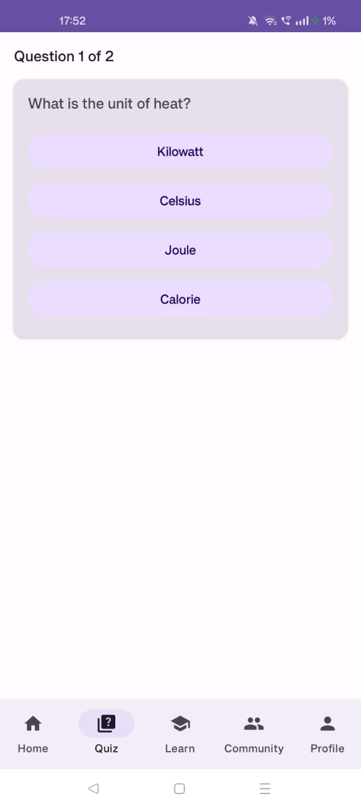
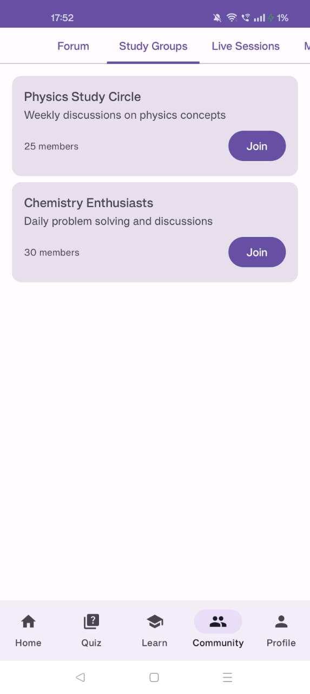

# BridgeLearn: AI-Powered Learning Platform

## Overview
BridgeLearn is an open-source educational platform designed to provide accessible, interactive learning experiences for students, with a focus on 7th-grade science education. The project is built using Kotlin and Jetpack Compose for Android.

## Features

### Core Functionality
- 🏠 **Interactive Home Dashboard**: Browse subjects and access quick learning resources
- 📚 **Learn Module**: Interactive lessons, simulations, and study materials
- ✍️ **Quiz System**: Self-assessment with immediate feedback
- 👥 **Community Features**: Discussion forums and study groups
- 👤 **Profile Management**: Track progress and customize learning experience

### Technical Stack
- Language: Kotlin
- UI Framework: Jetpack Compose
- Architecture: MVVM
- Navigation: Compose Navigation
- State Management: StateFlow

## Screenshots
| Home | Interactive Learning | Profile & Achievements |
|:----------:|:----------------:|:-----------------:|
|  |  |  |
| *Main dashboard with subjects and AI prompt* | *Subject-wise learning materials* | *User profile with learning stats and achievements* |

| Quiz Section | Study Groups | Discussion Forums |
|:----------:|:----------------:|:-----------------:|
|  |  |  |
| *Intuitive Quiz Section for Practice and Revision* | *Study Groups According to Subjects* | *Discussion Forums for Doubts* |

## Getting Started

### Prerequisites
- Android Studio Hedgehog | 2023.1.1
- Kotlin 1.9.0
- Minimum SDK: 24
- Target SDK: 34

### Setup
1. Fork the repository
2. Clone your fork:
```bash
git clone https://github.com/YOUR-USERNAME/BridgeLearn_App.git
```
3. Add upstream remote:
```bash
git remote add upstream https://github.com/pratheekv39/BridgeLearn_App.git
```
4. Create a new branch for your feature:
```bash
git checkout -b feature/your-feature-name
```

### Build and Run
1. Open project in Android Studio
2. Sync Gradle files
3. Run on emulator or physical device

## Contributing

### Areas for Contribution
1. Learn Module
   - Virtual lab simulations
   - Interactive content creation
   - Progress tracking

2. Community Features
   - Live session implementation
   - Mentorship system
   - Content moderation

3. Profile Section
   - Profile image management
   - Achievement system
   - Learning analytics

4. Accessibility
   - Screen reader support
   - High contrast themes
   - Language localization

### Contribution Guidelines
1. **Fork & Branch**: Create a feature branch from `main`
2. **Commit Messages**: Follow conventional commits format
3. **Code Style**: Adhere to Kotlin coding conventions
4. **Testing**: Include unit tests for new features
5. **Documentation**: Update README and inline documentation
6. **Pull Request**: Submit PR with comprehensive description

### Pull Request Process
1. Update CHANGELOG.md
2. Ensure CI checks pass
3. Obtain code review approval
4. Squash commits when merging

## Project Structure
```
app/
├── src/
│   ├── main/
│   │   ├── java/pratheekv39/bridgelearn/io/
│   │   │   ├── ui/
│   │   │   │   ├── home/
│   │   │   │   ├── learn/
│   │   │   │   ├── quiz/
│   │   │   │   ├── community/
│   │   │   │   └── profile/
│   │   │   ├── data/
│   │   │   ├── domain/
│   │   │   └── di/
│   │   └── res/
│   └── test/
└── build.gradle.kts
```

## Future Roadmap
- [ ] Offline support
- [ ] Real-time collaboration
- [ ] Parent dashboard
- [ ] Teacher tools
- [ ] Content authoring system

## License
This project is licensed under the MIT License - see LICENSE.md for details

## Contact
- Project Lead: [@pratheekv39](https://github.com/pratheekv39)
- Project Link: [https://github.com/pratheekv39/BridgeLearn](https://github.com/pratheekv39/BridgeLearn)
